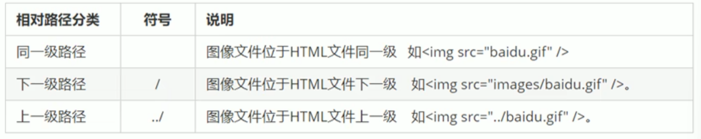
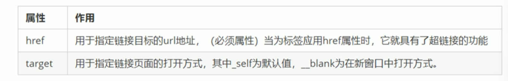
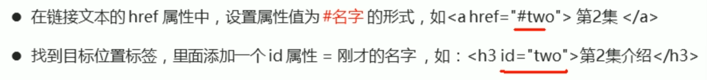
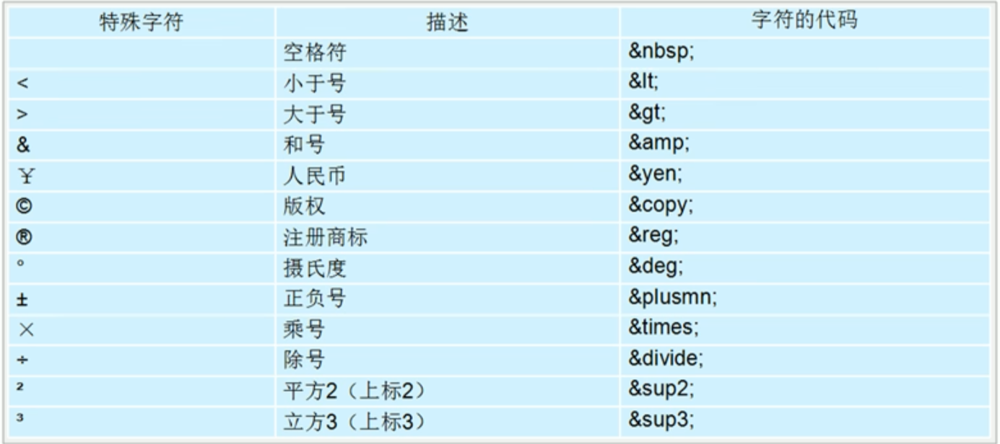
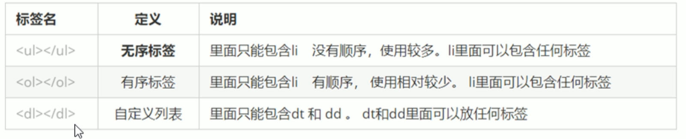
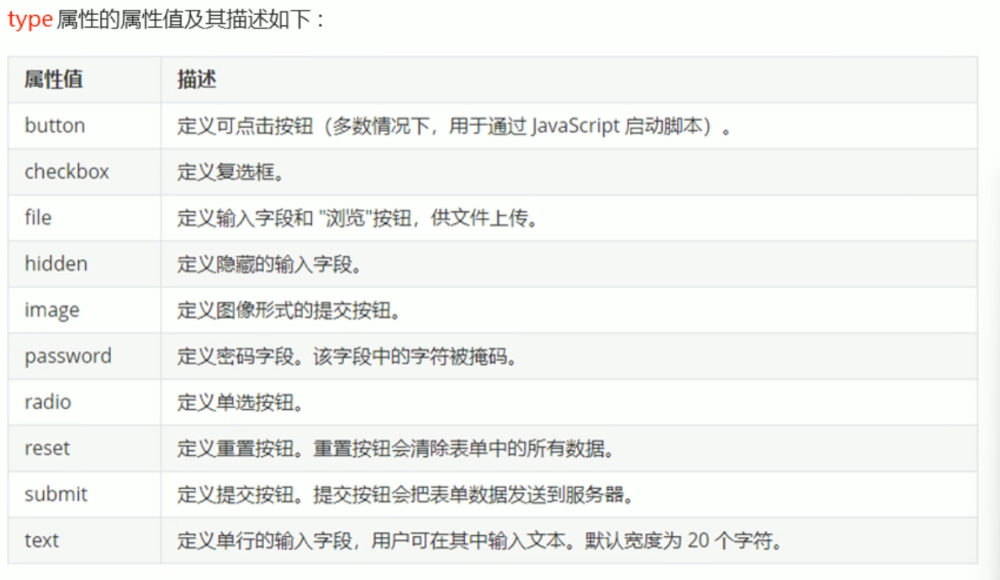
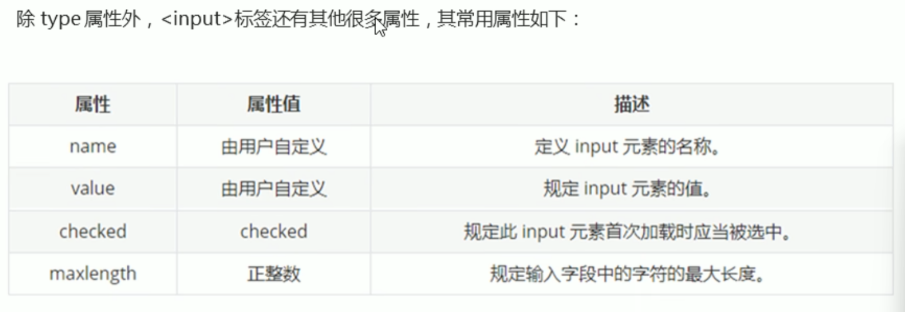

# Html基本结构标签

\<html\>\</html\> （之后省略格式） HTML标签

head 文档的头部

title 文档的标题

body 文档的主题

# 文档类型声明标签

\<!DOCTYPE\> 文档使用的html版本类型，固定在文档首部

\<html lang = "zh-CN"\> 文档语言类型

\<meta charset = "UTF-8"\> 使用UTF-8字符集

# Html常用标签

h1-h6 标题标签

p 段落标签

\  换行标签

strong或b 加粗

em或i 倾斜

del或s 删除线

ins或u 下划线

hr 水平分割线

## 布局

div 用于布局，行切盒，独占一行

span 用于布局，竖切盒,，可在div里放多个span

## 图像

\ src即路径，同目录下则直接贴图像名

图像标签的属性：

src 图片路径 必须属性

alt 文本 替换文本。图像不能显示时显示的文字

title 文本 提示文本。鼠标放上去显示的文字

只设置高度或宽度是等比例缩放，同时修改是拉伸缩放

width 像素 图像宽度

height 像素 图像高度

border 像素 图像边框粗细

## 图像路径

相对路径：图片相对于html文件的位置

绝对路径：目录下的绝对位置，从盘符开始

## 超链接

\< a href = "跳转目标" target = "目标窗口的弹出方式"\>

文本或图像

\</a\> 注：a即anchor

href可以指向外部链接、内部链接、空链接、下载链接、网页元素链接、锚点链接

外部链接前面添加http://用url，内部链接用页面位置与名称即可

内部链接即本地的html文件

空连接用#表示

如果指向文件或压缩包，则是下载链接，会下载该文件

文本、图像、表格、音频、视频等都可加超链接，即网页元素链接

锚点链接用于快速定位页面内位置，此时href=#名字，所定位的标签添加属性id="名字"

target的默认值是_self

## 注释ctrl+/

\<!- - - -\> 注释标签

## 特殊字符 记得加分号；空格nbsp; 小于\<&It; 大于\>\&gt;

## 表格标签

\<table\>

\<tr\>

> \<td\> 单元格内的文字 \</td\>
>
> ... ...

\</tr\>

... ...

\</table\>

tr 行

td 单元格

thead 表头（第一行）

th 表头单元格（第一行的单元格，加粗居中）

tbody 表格主体

### 表格属性（不常用，一般用css）

属性名 属性值 描述

align left、center、right 对齐方式(整个表格,不是元素)

border 1或"" 是否拥有边框，默认无

cellpadding 像素值 单元边沿与内容间的空白(默认1)

cellspacing 像素值 单元格之间的空白(默认2)

width 像素值或百分比 表格宽度

height 像素值或百分比 表格高度

### 合并单元格

rowspan 跨行合并

colspan 跨列合并

跨行合并的目标单元格为最上面的单元格

跨列合并的目标单元格为最左侧的单元格

找到目标单元格，添加合并方式 = 合并的单元格数量

\<td colspan = "2"\> \</td\>

最后删除多余单元格（被合并的单元格）

## 列表

整齐有序，用于布局页面，但布局用css

无序列表、有序列表、自定义列表

列表的样式一般用css设置

### 无序列表ul

\<ul\>

\<li\> 列表项1 \</li\>

… …

\</ul\>

ul标签中只允许嵌套li，而li中可以放任意元素

去掉前面的点，用css设置属性list-style为none

### 有序列表ol

列表项前有排序符号

\<ol\>

\<li\> 列表项1 \</li\>

… …

\</ol\>

### 自定义列表dl

用于对术语或名词进行解释描述，列表项前没有符号

\<dl\>

\<dt\>名词1\</dt\>

\<dd\>名词1解释1\</dd\>

\<dd\>名词2解释2\</dd\>

… …

\</dl\>

dl里只能用dt和dd，dt和dd没有个数限制

## 表单标签

构成：表单域、表单控件（表单元素）、提示信息

## 表单域\<form\>

\<form action = "url " method = "提交方式" name = "表单域名称"\>

各种表单元素

\</form\>

表单域是一个包含表单元素的区域

form把他范围内的表单元素信息提交给服务器

常用属性：

属性 属性值 作用

action url地址 指定接收处理表单数据的服务器程序的url

method get/post 设置表单数据的提交方式

name 名称 指定表单名称，区分同页面的多个表单域

在js内，可以使用.reset()重置表单

### 表单控件（表单元素）

#### label标签

label为input元素定义标注（标签），用于绑定一个表单元素，当点击label标签内的文本时，浏览器自动将光标转到对应元素上，增加用户体验

label的for属性应当与相关元素的id属性相同

\<label for = "male"\>男\</label\>

\<input type = "radio" id = "male"\>

#### \<input\>输入表单元素（单标签）

\<input\>用于收集用户信息，包含必须属性type，指定输入字段形式

快速输入type类型的方法：输入input:submit按tab

name和value主要留给后端，

单选按钮要用相同的name，value可作默认显示的文字

checked的值只能是checked，用于设置默认值/选项

button搭配js使用，一般用于启动js脚本

还可以用button标签

\<button\>免费注册\</button\>，跳转到form的action值

例：

用户名：\<input type = "text" name = "username" value = "用户名"\>

性别：男 \<input type = "radio" name = "gender" value = "男"\>

> 女 \<input type = "radio" name = "gender" value = "女"\>

\<input type = "submit" value = "免费注册"\>

**radio是单选按钮，想要实现单选还要指定相同name**

**checkbox是多选框**

#### select下拉表单元素

\<select\>

\<option\>选项1\</option\>

\<option\>选项2\</option\>

… …

\</select\>

select中至少包含一个option

在option内定义selected属性的值为selected，设为默认选中项目

#### textarea文本域元素

用于多行文本输入，常用于评论、留言板

\<texstarea rows = "3" cols = 20""\>

默认文本内容

\</textarea\>

cols是每行中的字符数量，rows是显示的行数量，实际开发用css
