# 书写位置

## html内部，写在body区域底部

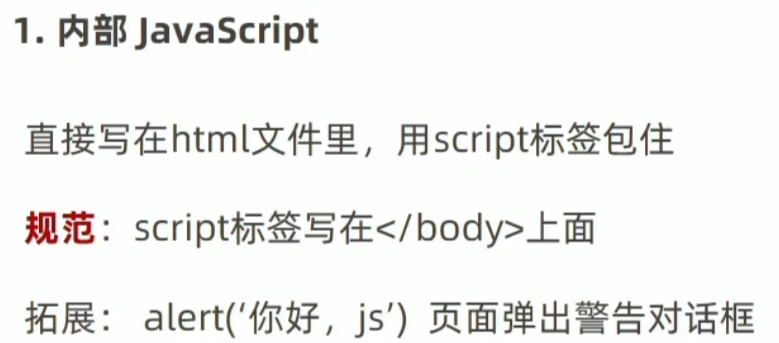

如果仅仅是某段样式要用，也可写在body内

## html外部及引入方式

可以将js文件打包为文件夹再引入相对路径

此时script标签内的代码会被忽略

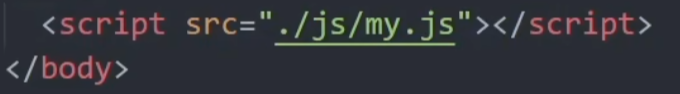

## 内联方式（直接写在标签内）

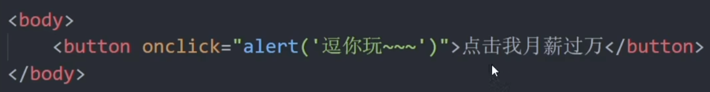

# 输入输出语法

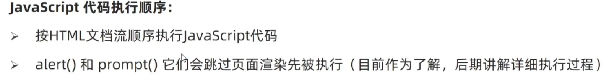

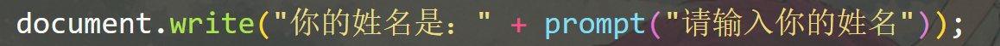

## 输出语法

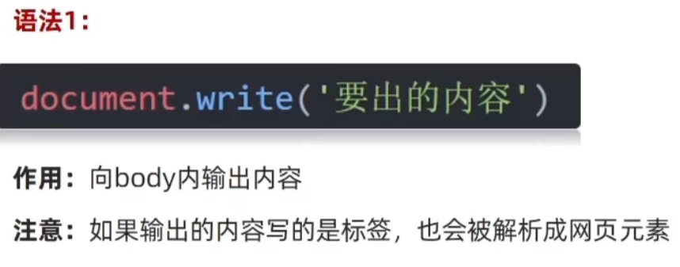

如document.write(‘\<h1\>一级标题\</h1\>’)会显示标题

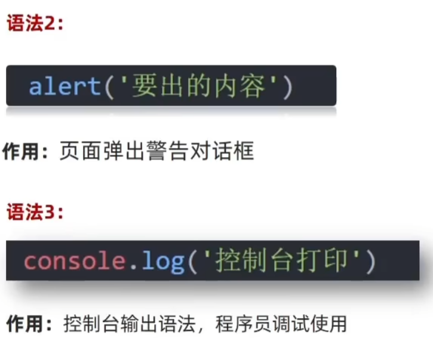

可以用+号连接输出内容

**confirm确认框:由用户决定返回true或false**

## 输入语法

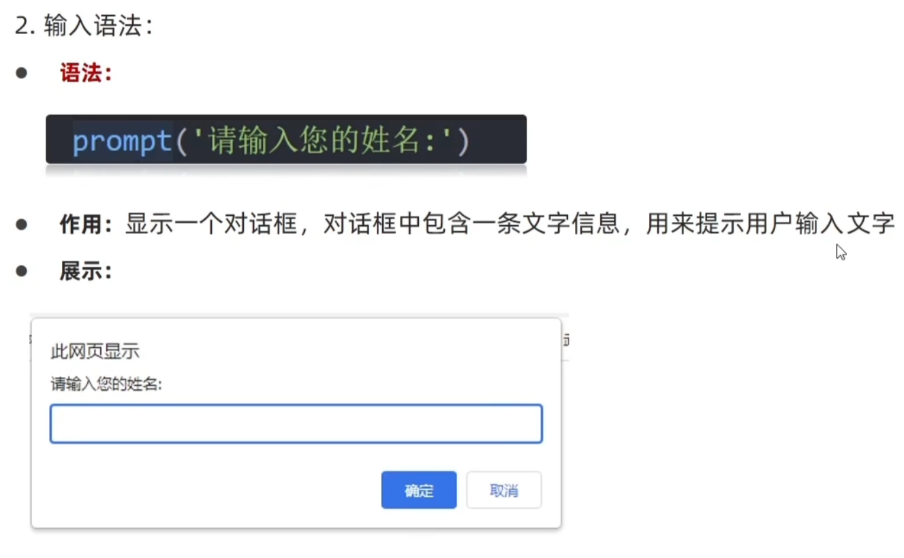

输入的数据作为prompt的返回值，括号内为提示文本

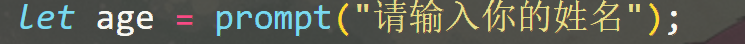

# 变量的基本使用

## let

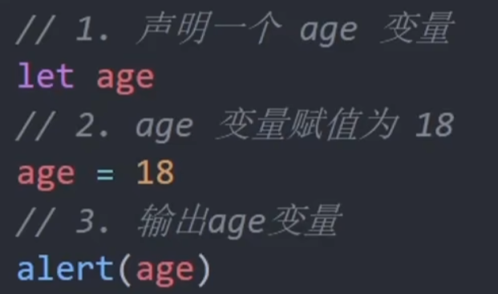

## 变量初始化

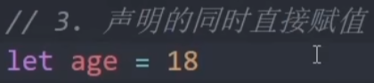

## 初始化多个变量

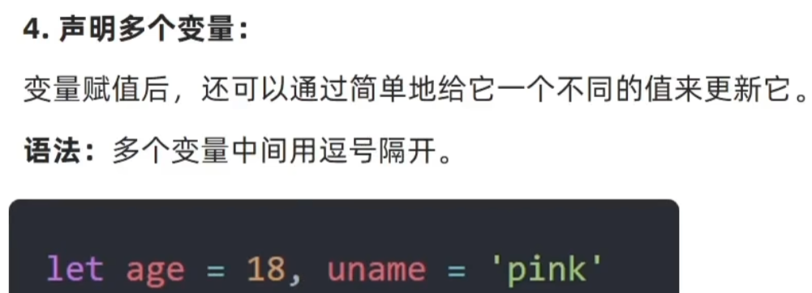

## 更新变量

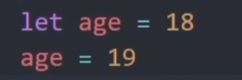

## var与let的区别

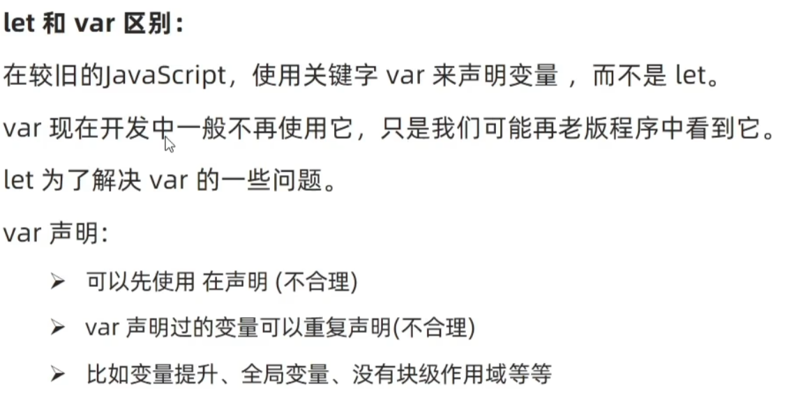

# 常量使用的注意点（数组和对象建议用const声明）

使用const进行声明，不变的数据应该比let更优先使用

数组和对象作为引用数据类型，可以在使用const声明的情况下修改被引用的数据内容，即可将其看做保存的地址不变的指针

# 数组

## 声明数组

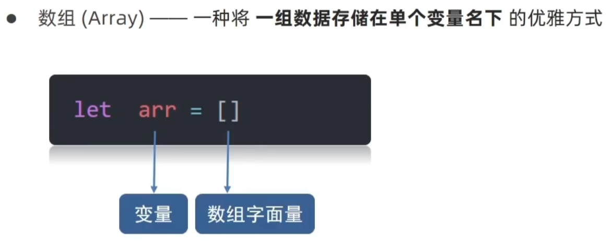

## 初始化（注意是中括号）

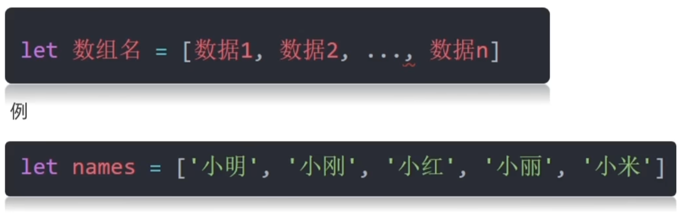

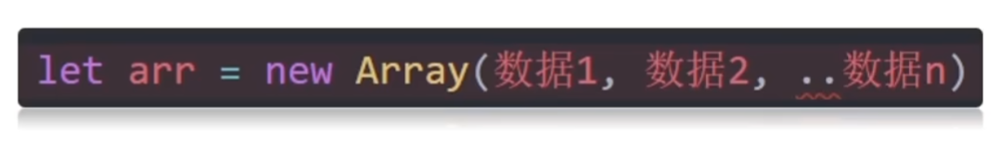

## 取值

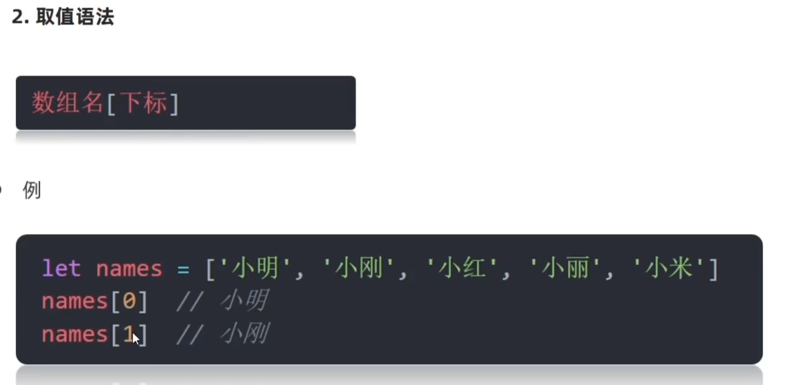

## 一些属性

**数组长度**arr.length

**添加元素**

arr.push(新增元素) 注意：该方法返回length

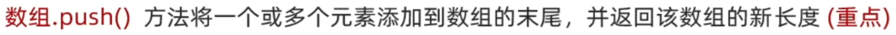

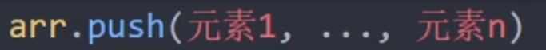

arr.unshift(新增元素) 注意：该方法返回length

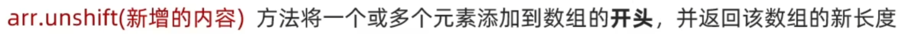

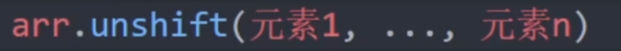

**删除元素**

arr.pop() 注意：该方法返回删除的元素值

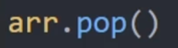

arr.shift() 注意：该方法返回删除的元素值

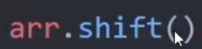

arr.splice(起始位置，删除元素个数)

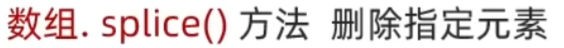

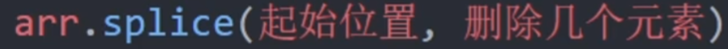

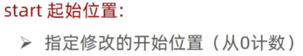

例：arr.splice(n,1)，删除下标为n的元素

arr.splice(n)，删除下标n及之后的元素

# 常量

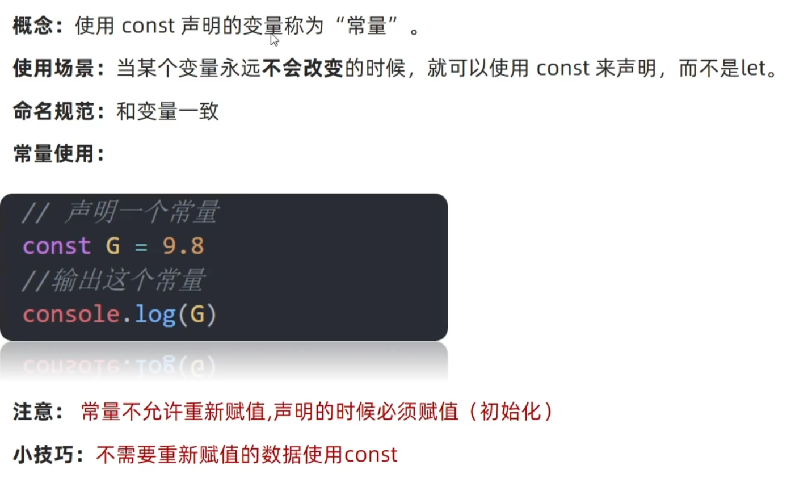

## 数组展开运算符...

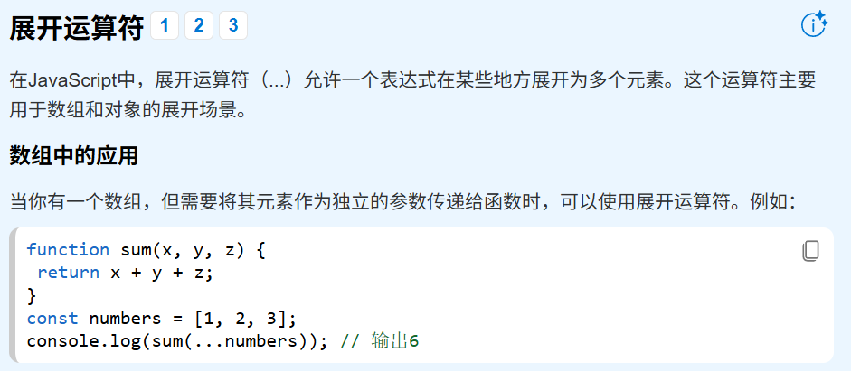

# 数据类型

**基本数据类型/简单数据类型：放到栈里面**

Number string Boolean undefined null

**引用数据类型：放到堆里面**

Object Array Date

## 数字型Number 包括整数、小数、正负数和NaN

**运算符**

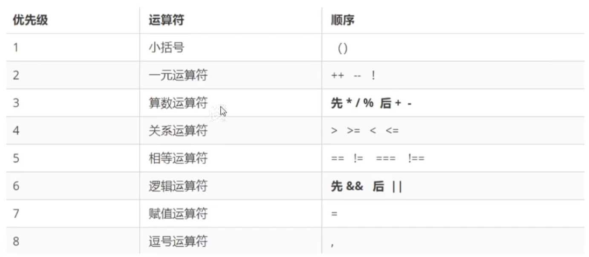

## 字符串类型string

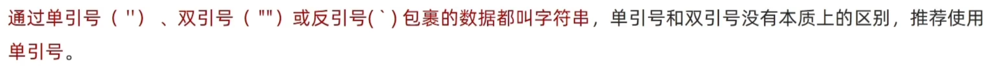

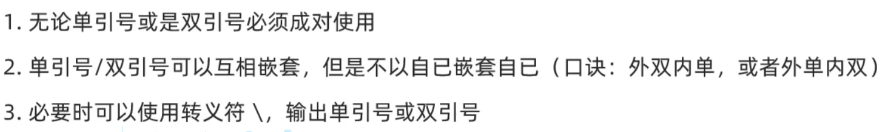

### 字符串拼接：使用+号

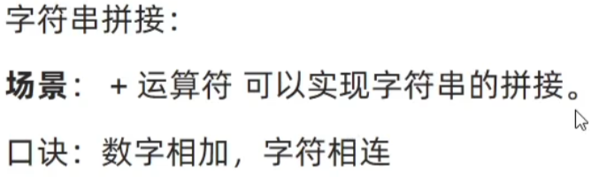

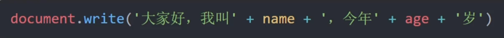

### 模板字符串：使用 \` 符号，拼接字符串与变量

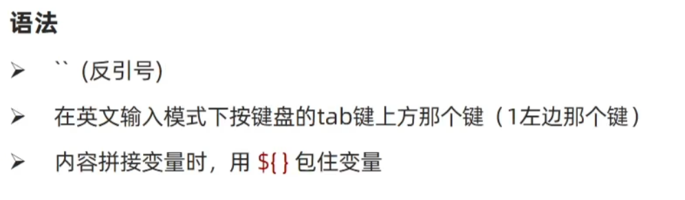

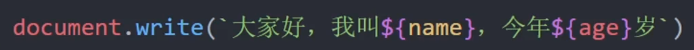

\${}里可以写运算式，打印时打印计算结果

## 布尔类型boolean

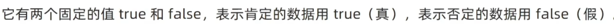

## 未定义类型undefined：无赋值

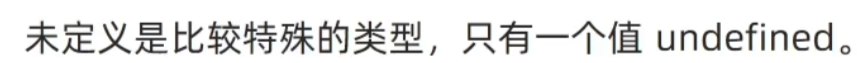

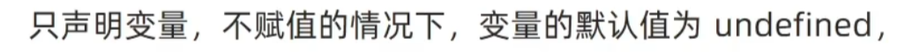

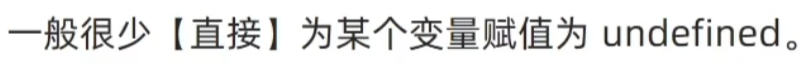

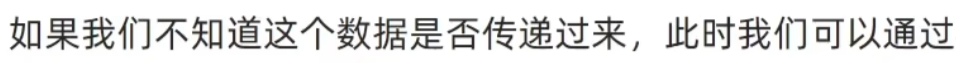

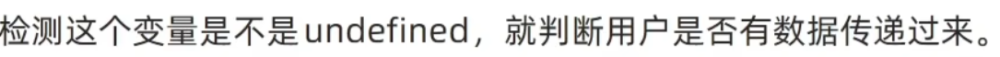

## 空类型null：有赋值，内容为空

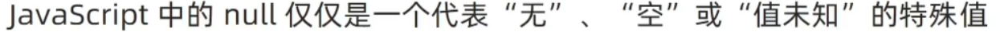

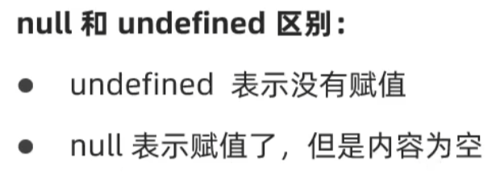
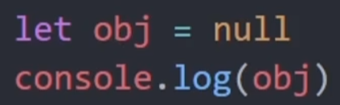

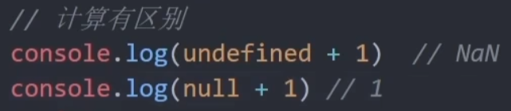

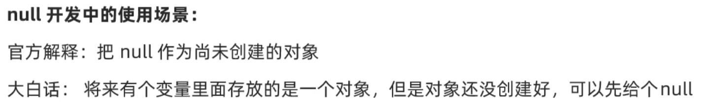

## null = = indefined为真，而null = = = undefined为假

## 检测数据类型：typeof

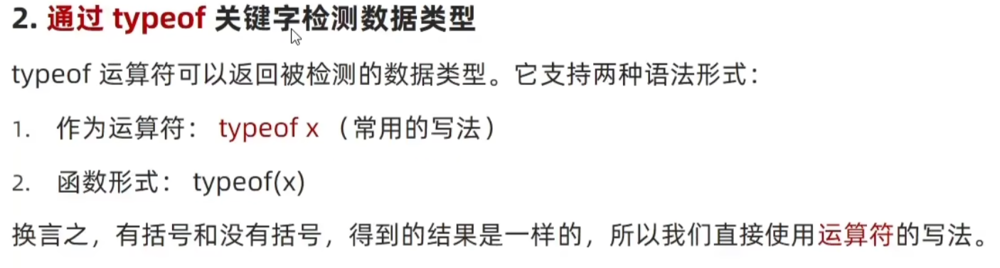

prompt等表单和框返回的默认的是字符串类型

# 类型转换

## 隐式转换

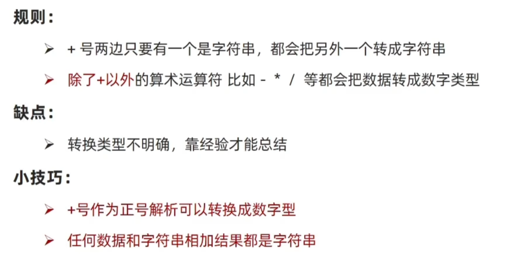

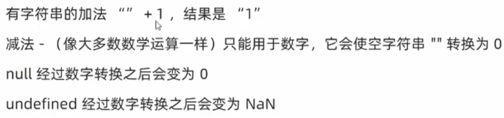

**有内容的字符串经过减法运算也是NaN**

## 显式转换

**转换为数字型**

**parse会自动取开头的数字，切掉末尾**

**转换为Boolean型**

# js中的比较运算符和

**switch的值比较使用全等===**

# if和for、while等语句省略

没有do while，注意for括号内是let i = 1

# 函数

## 函数的声明和调用

函数可以写在紧挨着\<script\>的内部的顶部

## 函数传参和调用函数

可以给函数加上形式参数默认值

## 通过逻辑中断设置默认参数值

## 函数返回值（不返回return则返回undefined）

## 函数作用域的全局变量（不提倡）

在函数内部，如果变量没有声明直接赋值，则该变量视作全局变量

对该变量的修改会确实修改域外的变量

该方法在严格模式下会报错。

## 匿名函数 无法直接使用

### 函数表达式

### 立即执行函数（无需调用直接执行，必须加分号）

两个括号，第二个括号的含义是立即调用函数

立即执行函数也可以加实参和形参，避免全局污染

# 对象 （object类）

## 创建对象 使用let声明

对象由**属性**和**方法**组成

## 对象属性（类似css的写法，但是用逗号分隔）

注意：引号的添加不改变属性的唯一性。

即‘name’和name是同一个属性，引号只是方便取名

## 对象属性使用：增删查改

调用属性的另一种方式：对象名\[ '属性名' \]，类似字典

这种方式只可用于调用带引号的属性，

如上面的obj \[ 'good-name' \]

## 对象方法

实际上对象中的方法是一个特殊的属性，其值是匿名函数，因此创建方式跟属性相同。可以添加形参实参

引号的使用方式也跟普通属性相同

## 遍历对象

由于对象无序切长度未知，无法使用for(let i=0;i\<a.length;i++)遍历

而是使用**for**(let k **in** obj)，调用属性值的方式类似数组

当用于遍历**数组**时，**k是索引号**，并且**是string型**而不是数字

当用于遍历**对象**时，**k是属性名，也是string型**

对象**属性名**是**k**，对象**属性值**是**obj \[ k
\]**（中括号内**不需要引号**）

遍历常用于**对象数组**，该类数组一般作为配置的数据信息

遍历的方式与数组相同

## js内置对象Math

round：四舍五入

对数组找最大最小值可用展开运算符Math.max(…\[1,2,3,4\])

## 生成随机数Math.floor( Math.random()\*(M-N+1) )+N

将10之后的小数舍去即可取到10

getRandom函数，取M到N包含两端的随机数

