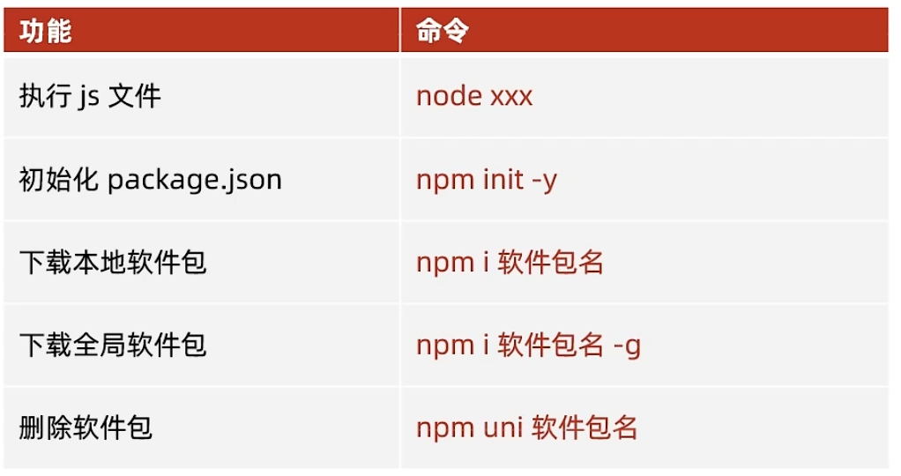

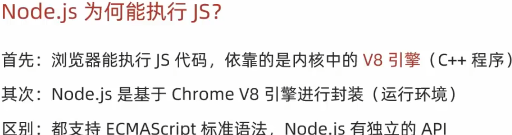

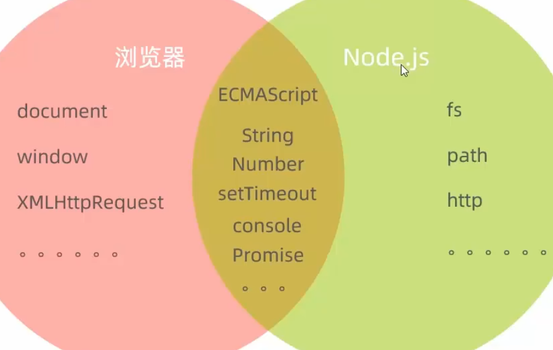

在终端内输入node xxx(文件名)来运行js文件

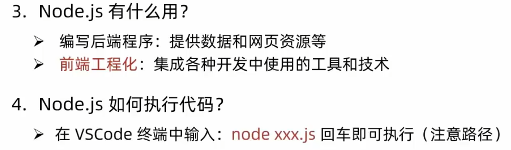

# fs模块-读写文件

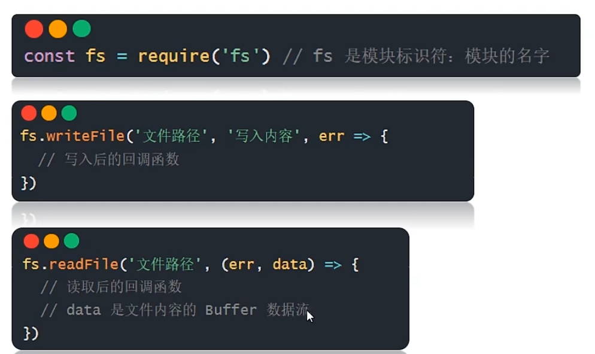

Buffer数据流是数据在计算机内部的表示形式(字节)

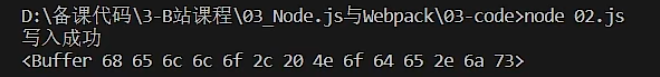

需要用data.toString()转成正常字符串

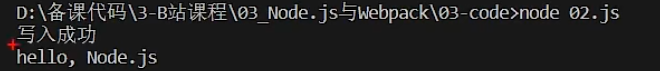

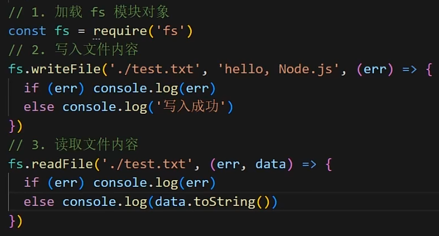

# path

即以终端所在文件夹为起点，访问文件夹外的文件无需找父目录

windows和mac的路径分隔符不同

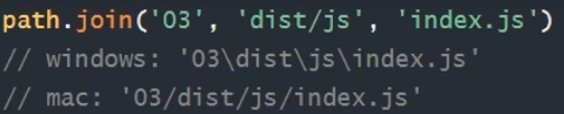

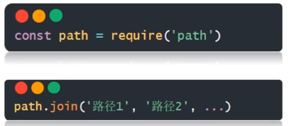

# 通过正则表达式去掉换行符和回车符以压缩html文件

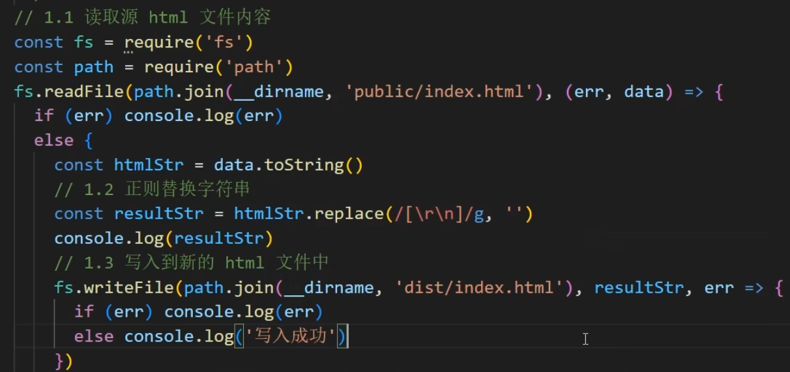

# 基于http模块创建web服务

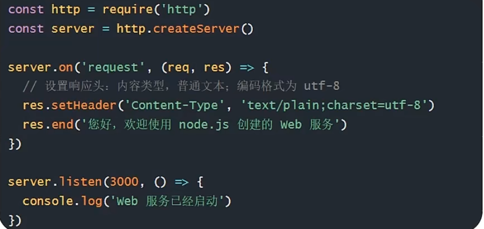

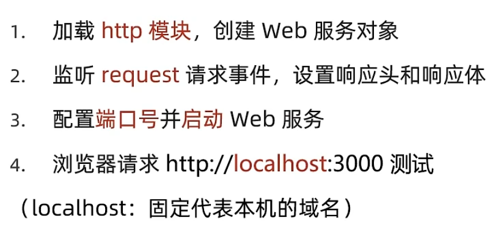

3000为端口号，1000左右以下的端口号被特殊占用，尽量设大

## 创建web请求服务

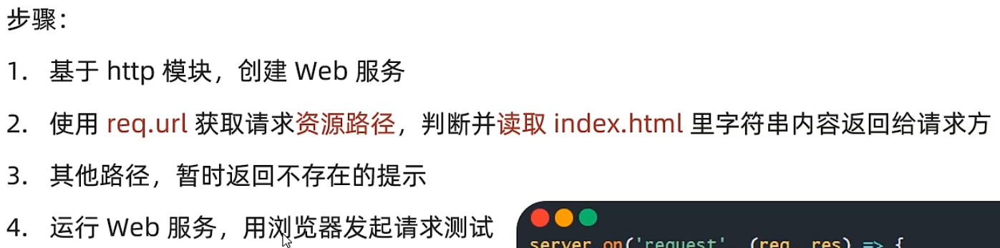

通过req.url判断请求的资源位于本机何处

注意setHeader里的文本类型要改成html

最后要设置监听端口

# Nodejs的模块化

## CommonJS标准（nodejs默认标准）

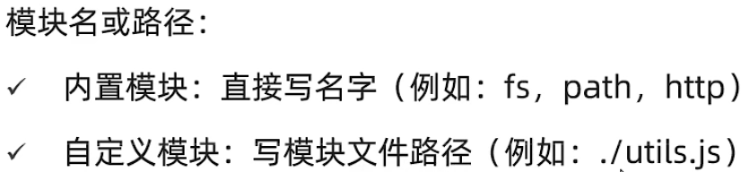

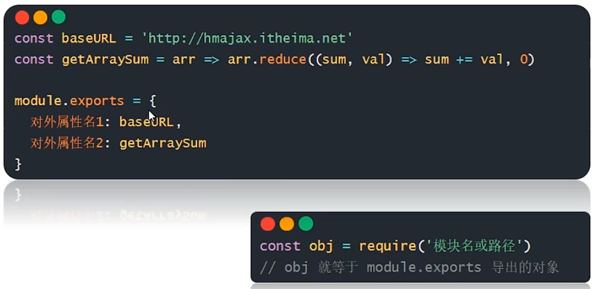

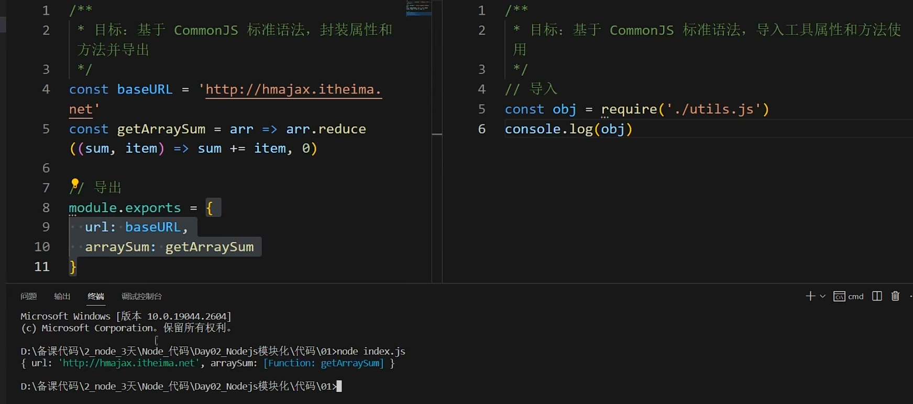

## ECMAScript标准-默认导出导入

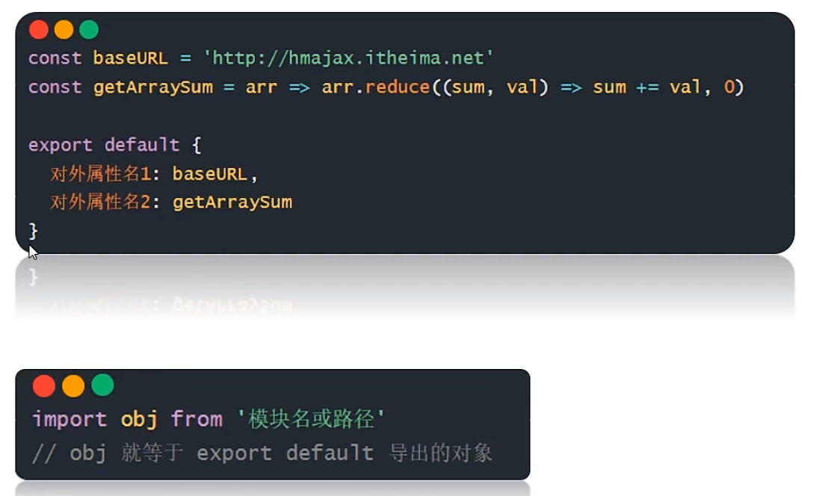

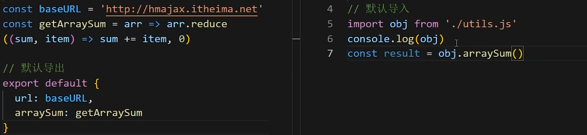

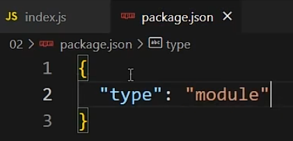

## ECMAScript标准-命名导出导入

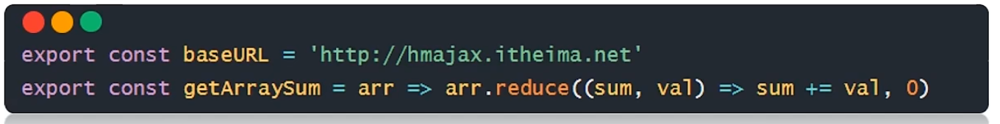

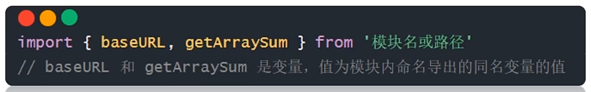

# 包

index的内容及作用

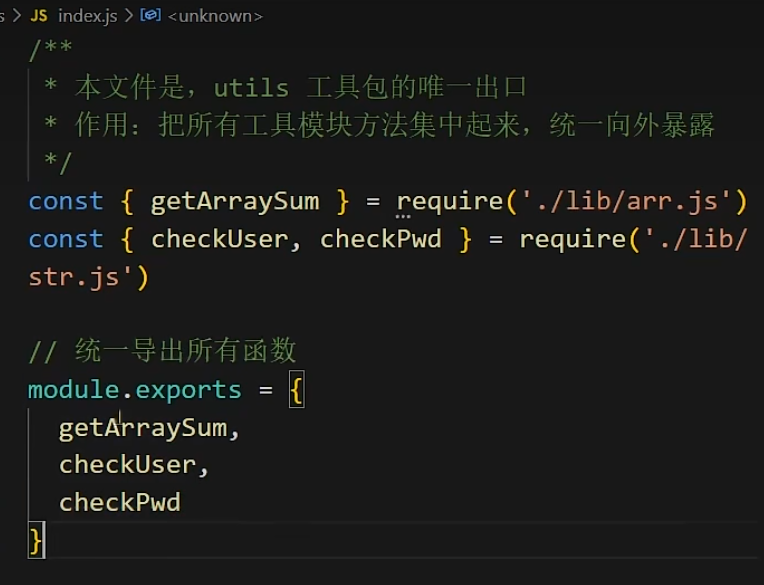

## npm-软件包管理器

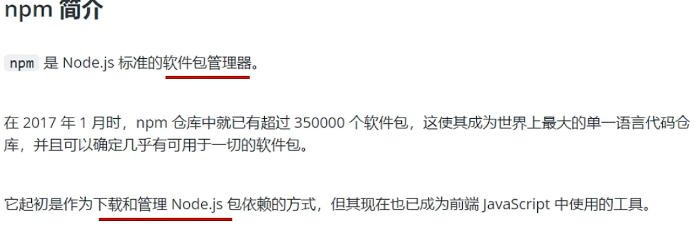

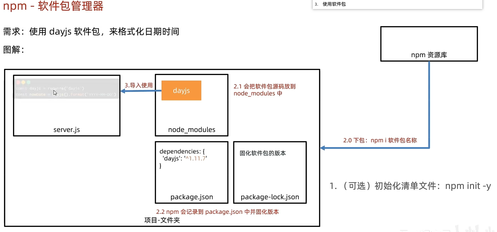

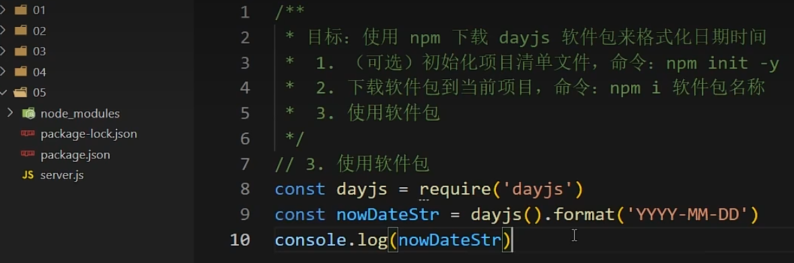

## 安装所有依赖

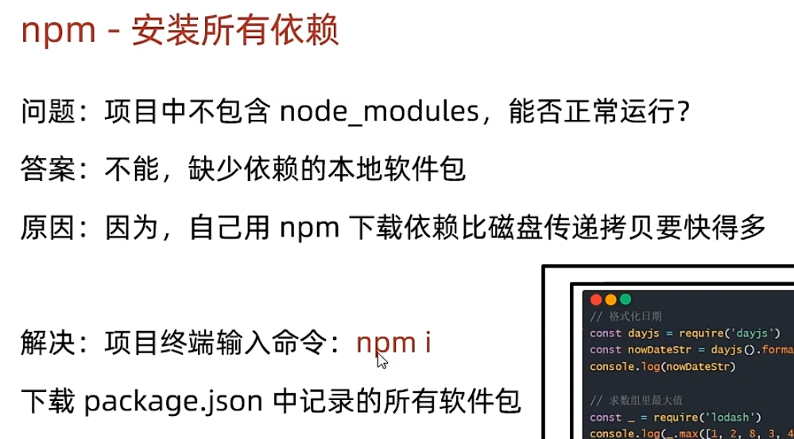

## 全局软件包nodemon

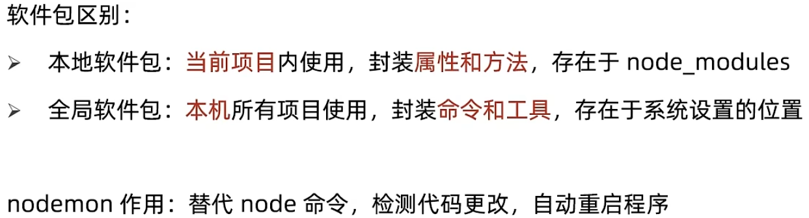

